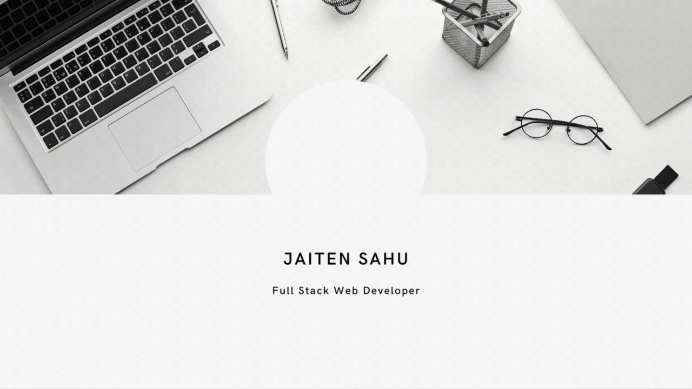

<h1 align="center">Hi 👋, I'm Jaiten Sahu</h1>
<h3 align="center">A passionate full stack web developer from India</h3>

  

  

- 🌱 Currently working as **Frontend Developer at Kommunicate**

- 💬 Ask me about **HTML, CSS, JavaScript, React, NodeJS, MongoDb Figma**

- 📫 How to reach me **jaitensahu9@gmail.com**

- ⚡ Fun fact **I m Good Dancer**

<h3 align="left">Connect with me:</h3>

## Badges 

<h3 align="left">Languages and Tools:</h3>

 
 
 
              

&nbsp;

